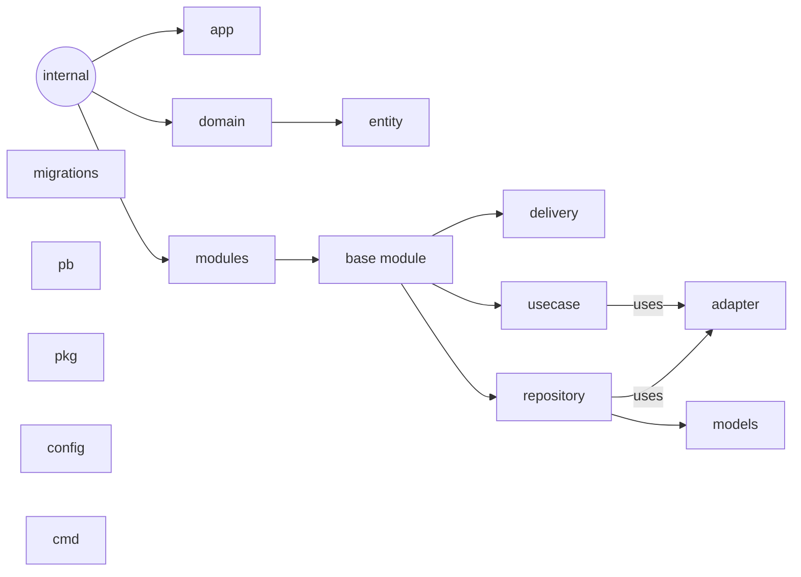

Based on Data Driven Design, we have segregated our charge in a separate, isolated domain. 

main parts of the project:


## Setup:
Before starting the application, one can migrate the database and check the connections with third party clients.

#### config file
for generate configs:
```
    make config
```
now we generate 2 configs for you:
- config.yaml (application reads data from this file for start)
- config.test.yaml (for test cases application read data from this file)

for migrate database and seed data into database
```
    go run main.go migrate init
    go run main.go migrate up
    go run main.go seed
```
    

## Submit a new service

We are *http1.1* agnostic. Everything should be came in **grpc** and well-defined in **protobufs**. To add a new service do as follows:

- explicitly define the service ib ```api/proto```
- run the following command in terminal
``` make proto```
- one should manipulate the ```app/router``` (clarifications needed)

#### services:
 - service tracer: jaeger
 - config server: etcd
 - cmd: cobra
 - configs: from file(dev), from config server(prod)
 - logger: zap
 - database: postgres(go-pg)
 - database ui: pgAdmin




    .
    ├── adapter/              # Clients of cache like Redis or broker exist here
    ├── cmd/                  # All commands and entry points of the application
    │   ├── migrate_cmd.go    # Migration command
    │   ├── root_cmd.go       # Root command
    │   ├── seed_cmd.go       # Seed command
    │   └── test_cmd.go       # Test command
    ├── config/               # Configuration files
    │   ├── env/              # Environment variable files
    │   ├── config.go         # Configuration loader
    │   └── database.go       # Database configuration
    ├── internal/             # Main logic of the application
    │   ├── app/              # Files to serve the application
    │   ├── domain/           # Entity structs
    │   └── modules/          # Application modules
    │       ├── some_module/  # Sample module
    │       │   ├── delivery/          # Delivery layer
    │       │   ├── repository/        # Repository layer (implements base_repository_contract.go)
    │       │   ├── usecase/           # Usecase layer (implements base_service.go)
    │       │   ├── base_repository_contract.go  # Repository interface
    │       │   └── base_service.go    # Service interface
    ├── migrations/           # Migration files
    ├── models/               # Database models
    ├── pb/                   # Protocol buffer files
    └── pkg/                  # Utility packages
    ├── crypt/            # Encryption utilities
    ├── gerrors/          # Custom error types
    ├── it/               # Integration test utilities
    ├── lambda/           # AWS Lambda integration utilities
    ├── lang/             # Language utilities
    ├── list/             # List utilities
    ├── logger/           # Logging utilities
    ├── mocks/            # Mock data for unit tests
    ├── oauth/            # OAuth 2.0 utilities
    ├── validator/        # Input validation utilities
    └── README.md         # Package documentation


## Directory Structure

- `adapter`: This directory contains the clients of the cache and broker, such as Redis or NATS. These clients are used to interact with external systems or services and abstract away their implementation details.
- `cmd`: This directory contains all the commands and entry points of the application. Here you'll find files to start the application, run migrations, and seed data.
- `config`: This directory contains all the configuration files for the application, such as environment variables, database configuration files, and any other configuration related to the application.
- `internal`: This directory contains the main logic of the application. Here you'll find all the code that makes up the application, including the business logic, use cases, repository implementations, and other supporting code.
- - `app`: This directory contains files to serve the application, such as HTTP or gRPC handlers and middleware.
- - `domain`: This directory contains entity structs that represent the domain model of the application.
- - `modules`: This directory contains code related to application modules, which are used to logically group functionality. For example, you may have a "users" module that contains all the code related to user management. Each module contains:
    - `delivery`: This directory contains the code that handles incoming requests and outgoing responses for the module.
    - `repository`: This directory contains the implementation of the repository interface defined in base_repository_contract.go.
    - `usecase`: This directory contains the implementation of the service interface defined in base_service.go.
    - `base_repository_contract.go`: This file contains the repository interface, which defines the contract for any implementation of a repository.
    - `base_service.go`: This file contains the service interface, which defines the contract for any implementation of a service.
- `migrations`: This directory contains all the migration files for the database schema. These files are used to create, modify, and delete tables and other database objects.
- `models`: This directory contains the database models for the application. These models are used to interact with the database and represent the data stored in it.
- `pb`: This directory contains the protocol buffer (protobuf) files used to define the messages and services for the application.
- `pkg`: This directory contains all the utility code used throughout the application. This includes things like error handling, list processing, cryptography, logging, and mocking.
